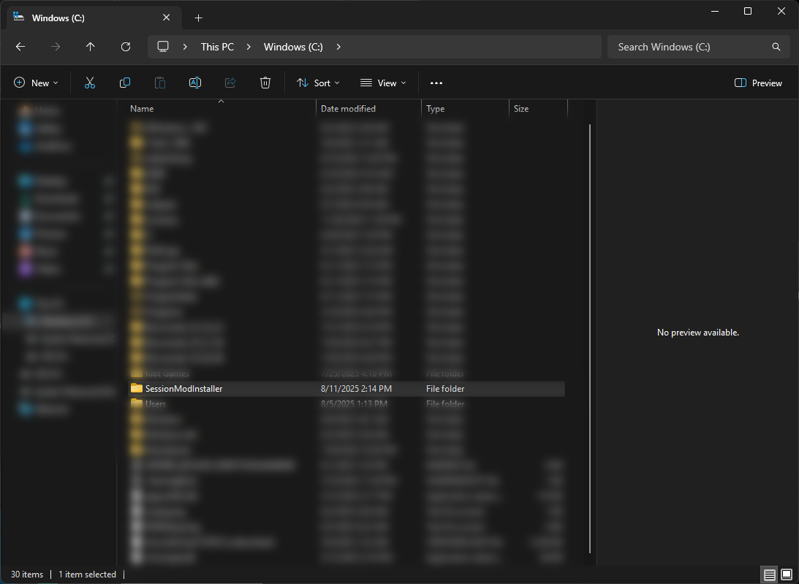

# SessionModInstaller 
[Source Code](https://github.com/Jcxeq/SessionModInstallerSourceCode)
‎

`✅ - means safe
⭐ - means recommended
👌 - means ok/alright`

‎ ‎ ‎ ‎ ‎ ‎ ‎ ‎ ‎ ‎ 
## Requirements before installation


## ⭐✅ [7-Zip](https://www.7-zip.org/download.html) OR  👌✅ [WinRar](https://www.rarlab.com/download.htm)
‎


## Installation

```bash
1) To run this program, you must have python. This can be found below!
```
# ⭐✅ [Download Python](https://www.python.org/downloads/)

```bash
2) Make sure to download the SessionModInstaller from releases, and EXTRACT folder to -> C/.
```
# ⭐✅ [Download SessionModInstaller](https://github.com/Jcxeq/SessionModInstaller/releases)

[](https://github.com/Jcxeq/SessionModInstaller)
```bash
3) Now go to C\SessionModInstaller, and Run RUN.bat to start SessionModInstaller.
```
```bash
4) Thats it.
```
